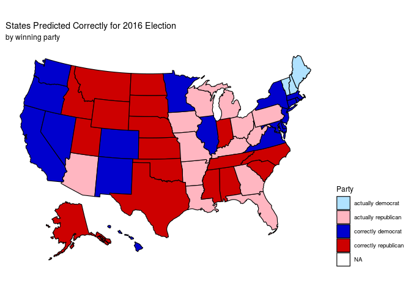

Booze and the Faith of America
================
Greyfriars Bobby

## Summary

Can alcohol consumption predict US general election results?

From our preliminary data analysis and visualization, we compared a
democratic state (California) and a republican state (North Dakota). We
observed North Dakota to consume much higher levels of beer in
comparison to California which is concordant with the results we’ve
expected. We used data on average alcohol consumption by state from
years 1977 to 2018. This data outlines the average volume of beer, wine
and spirit consumed per capita. We combined this information with voting
data on general elections. Next, we produced a data frame which
displayed, for a specific year, the average amount of beer, wine, or
spirit drunk per capita, and the political affiliation of that state
(since the last general election).

We were aiming to predict how a state would vote, based on their
drinking habits. We utilized the data frame we built that incorporates
the consumption and election data. Our experiment was to predict the
2016 election, so we created a logistic regression model and trained it
with data from 1977 to 2015. It cleans the voting data frame into a more
useful one. Once the conflicts have been fixed, we built a data frame
with voting data that will be friendly with our model. We were ready to
build a data frame to feed into our model. To predict each states winner
in the 2016 election we created a data frame where we compared our
predictions to the real values. The variables used were how much beer,
wine, and spirit that people drank on average.

<!-- -->

Our model correctly predicted the outcome of 34 states for 2016.
Although this is 68% accurate, the model couldn’t accurately predict the
general result of the election. Our model predicted a democrat victory
with 382 electoral votes. In reality, republicans won with 306 electoral
college votes.

We then proceeded to improve our model. We found that when taking spirit
drank per capita only, our model yielded a much better result for 2016
(and in fact 2012, 2008, and 2004 as well), correctly predicting 40 out
of 50 states. This is 80% accurate. Still, the outcome of the election
was predicted incorrectly. With improvements, the model predicted a
democrat victory with 328 votes. Still very far off the 232 ones they
earned in that election.

Our findings during this project came out to be very interesting. When
all alcohol types were used we achieved a 68% success rate. Through
further investigation we studied into the consumption of the other
alcohols which were wine and spirits. We could see that wine and spirit
were both more consumed among democrat than republican states. By using
spirit only we got our success rate up to 80%.Even though our improved
model yielded the wrong final outcome, we were a lot closer by making
our data more concise. Overall we were not able to establish a strong
correlation, and even if we were able to, correlation doesn’t imply
causation. We know how to make a logistic regression and manipulate data
much more efficiently and with less errors than before.

## Presentation

Our presentation can be found
<https://u-edinburgh.rstudio.cloud/ac30c4a4a5354af7b9075bd6186e8453/?view=rmarkdown>
or
<https://u-edinburgh.rstudio.cloud/ac30c4a4a5354af7b9075bd6186e8453/file_show?path=%2Fcloud%2Fproject%2Fpresentation%2Fpresentation.html#12>.
Our video presentation can be found
[https://www.youtube.com/watch?v=eYwtaEPAI6Q]()

## Data

Kaplan, Jacob. Apparent Per Capita Alcohol Consumption: National, State,
and Regional Trends 1977-2018. Ann Arbor, MI: Inter-university
Consortium for Political and Social Research \[distributor\],
2020-06-29. <https://doi.org/10.3886/E105583V4>

MIT Election Data and Science Lab. “U.S. President 1976–2016.” Harvard
Dataverse, Harvard Dataverse, 7 June 2019, doi.org/10.7910/DVN/42MVDX.

Mostipak, Jesse. “Beer Production.” Kaggle, 30 Mar. 2020,
www.kaggle.com/jessemostipak/beer-production.
