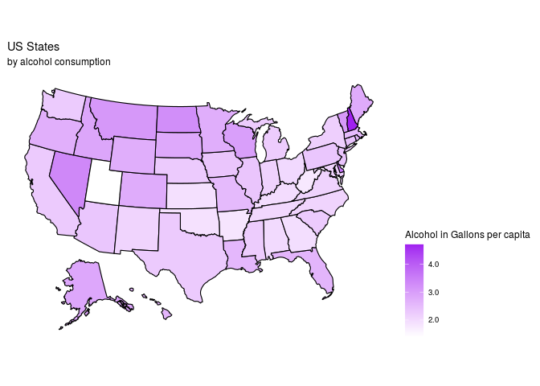
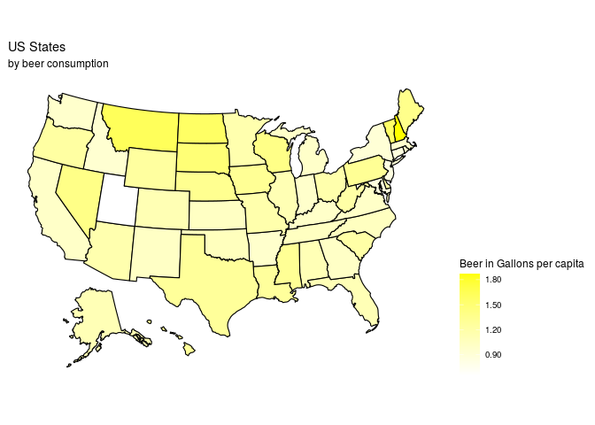
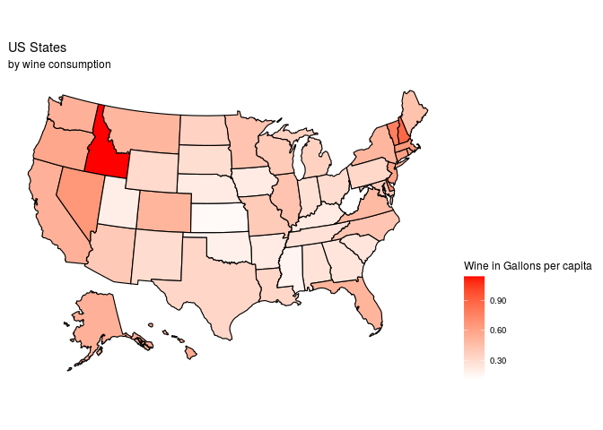
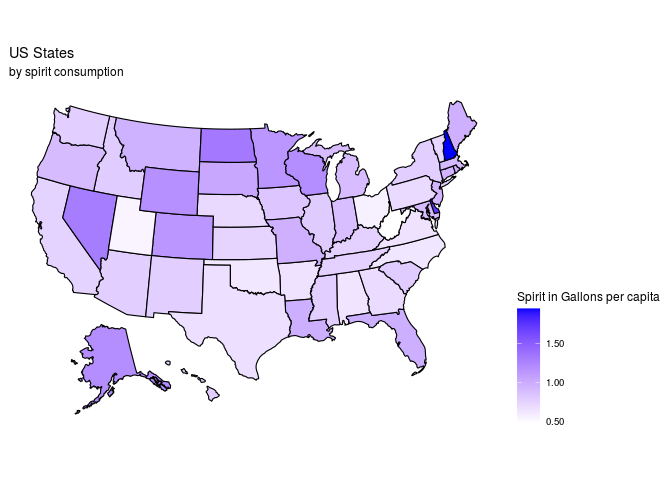

Alcohol Consumption Mapping
================

``` r
library(tidyverse)
library(broom)
library(here)
library(stringr)
library(openintro)
library(usmap)
library(ggplot2)
```

``` r
# apparent_per_capita_alcohol_consumption_1977_2018

consumption_per_capita <- read_csv("/cloud/project/data/apparent_per_capita_alcohol_consumption_1977_2018.txt")
```

    ## Parsed with column specification:
    ## cols(
    ##   state = col_character(),
    ##   year = col_double(),
    ##   ethanol_beer_gallons_per_capita = col_double(),
    ##   ethanol_wine_gallons_per_capita = col_double(),
    ##   ethanol_spirit_gallons_per_capita = col_double(),
    ##   ethanol_all_drinks_gallons_per_capita = col_double(),
    ##   number_of_beers = col_double(),
    ##   number_of_glasses_wine = col_double(),
    ##   number_of_shots_liquor = col_double(),
    ##   number_of_drinks_total = col_double()
    ## )

``` r
#capitalise state first letter on consumption_per_data so that it is standardized
consumption_per_capita <- consumption_per_capita %>%
  mutate(state = str_to_title (state))

# save it as a new csv for future reference
write_csv(consumption_per_capita, "/cloud/project/data/apparent_per_capita_alcohol_consumption_1977_2018.csv")

consumption_per_capita_2015 <- consumption_per_capita %>% 
    filter(year == 2015) 
```

Alcohol

``` r
 # mutate(fips = fips(state)) 
  # relocate(fips_code)
  
plot_usmap(data = consumption_per_capita_2015, regions = "state", values = "ethanol_all_drinks_gallons_per_capita", color = "black") + 
  scale_fill_continuous(
    low = "white", high = "purple", name = "Alcohol in Gallons per capita", label = scales::comma
  ) + theme(legend.position = "right") +
  labs(title = "US States", subtitle = "by alcohol consumption") +
  theme(legend.position = "right")
```

<!-- -->

Beer

``` r
 # mutate(fips = fips(state)) 
  # relocate(fips_code)
  
plot_usmap(data = consumption_per_capita_2015, regions = "state", values = "ethanol_beer_gallons_per_capita", color = "black") + 
  scale_fill_continuous(
    low = "white", high = "yellow", name = "Beer in Gallons per capita", label = scales::comma
  ) + theme(legend.position = "right") +
  labs(title = "US States", subtitle = "by beer consumption") +
  theme(legend.position = "right")
```

<!-- -->

Wine

``` r
 # mutate(fips = fips(state)) 
  # relocate(fips_code)
  
plot_usmap(data = consumption_per_capita_2015, regions = "state", values = "ethanol_wine_gallons_per_capita", color = "black") + 
  scale_fill_continuous(
    low = "white", high = "red", name = "Wine in Gallons per capita", label = scales::comma
  ) + theme(legend.position = "right") +
  labs(title = "US States", subtitle = "by wine consumption") +
  theme(legend.position = "right")
```

<!-- -->

Spirit

``` r
 # mutate(fips = fips(state)) 
  # relocate(fips_code)
  
plot_usmap(data = consumption_per_capita_2015, regions = "state", values = "ethanol_spirit_gallons_per_capita", color = "black") + 
  scale_fill_continuous(
    low = "white", high = "blue", name = "Spirit in Gallons per capita", label = scales::comma
  ) + theme(legend.position = "right") +
  labs(title = "US States", subtitle = "by spirit consumption") +
  theme(legend.position = "right")
```

<!-- -->
