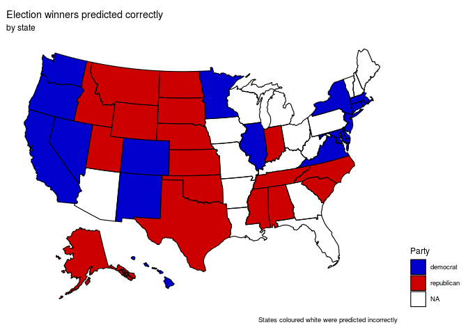

All together now
================

``` r
library(tidyverse)
library(broom)
library(openintro)
library(usmap)
library(tidymodels)
library(glue)
library(rlang)
library(here)
```

``` r
beer_states <- read_csv('https://raw.githubusercontent.com/rfordatascience/tidytuesday/master/data/2020/2020-03-31/beer_states.csv')
# Voting data
voter_data <- read_rds("/cloud/project/data/1976-2016-president.RData")

#Alcohol consumption per capita
consumption_per_capita <- read_csv("/cloud/project/data/apparent_per_capita_alcohol_consumption_1977_2018.txt")

electoral_votes <- read_csv("/cloud/project/data/electoral_votes.csv")
```

### Data wrangling

This chunk cleans the voting data frame into a more useful one.

``` r
# Manually merge some conflicting cells
# In some states there were two entries for the same candidate, resulting in an undesired outcome when pivoting the data

voter_data[(3536),] <- voter_data[(3536),] %>%
    mutate(candidatevotes = 1677928 + 78)
voter_data[(3537),] <- voter_data[(3537),] %>%
    mutate(candidatevotes = 943169 + 259)

# Manually rename more conflicting cells
# In Minnesota, for some years, the democrat party was entered as "democratic". Our algorithm didn't pick up the string and resulted in NA's

voter_data[(2211),] <- voter_data[(2211),] %>%
    mutate(party = "democrat")
voter_data[(2560),] <- voter_data[(2560),] %>%
    mutate(party = "democrat")
voter_data[(3226),] <- voter_data[(3226),] %>%
    mutate(party = "democrat")

# Eliminate conflicting rows

voter_data <- voter_data[-c(2545,3415,3543,3544),]
```

Once the conflicts have been fixed, we’re ready to build a data frame
with voting data that will be friendly with our model.

``` r
clean_votes <- voter_data %>%
  # Choose only the two main parties
  filter (party %in% c("democrat", "republican")) %>% 
  # Select the only variables we're interested in. Year, state, party, and how many votes the party received
  select(year, state, party, candidatevotes) %>% 
  pivot_wider(names_from = party, values_from = candidatevotes) %>%
  rename(democrat_votes = democrat, republican_votes = republican) %>%
  # Create a new variable that tells us who won the election in that state
  mutate(office = ifelse(democrat_votes > republican_votes, "democrat", "republican")) %>%
  # Filter so voting data is consistent with the rest of our data
  filter(year >= 1976)

glimpse(clean_votes)
```

    ## Rows: 561
    ## Columns: 5
    ## $ year             <int> 1976, 1976, 1976, 1976, 1976, 1976, 1976, 1976, 1976…
    ## $ state            <I<chr>> Alabama, Alaska, Arizona, Arkansas, California, C…
    ## $ democrat_votes   <dbl> 659170, 44058, 295602, 498604, 3742284, 460801, 6478…
    ## $ republican_votes <dbl> 504070, 71555, 418642, 267903, 3882244, 584278, 7192…
    ## $ office           <chr> "democrat", "republican", "republican", "democrat", …

Now we are ready to build a data frame to feed into our model

``` r
### Build consumption data frame
model_consumption <- consumption_per_capita %>%
  # Chose only years previous to 2016
  filter(year <= 2016) %>%
  # Clean names
  mutate(state = str_to_title (state)) %>%
  rename(
    beer_per_capita = ethanol_beer_gallons_per_capita,
    wine_per_capita = ethanol_wine_gallons_per_capita,
    spirit_per_capita = ethanol_spirit_gallons_per_capita)

### Build model data frame by joining consumption and votes

model_data <- full_join(model_consumption, clean_votes) %>%
  # Eliminate regions and DC, which doesn't have voter representation.
  filter(!(state %in% c("District Of Columbia", "District of Columbia", "Us Total", "South Region", "Northeast Region", "Midwest Region", "West Region"))) %>%
  select(c("year", "state", "beer_per_capita", "wine_per_capita", "spirit_per_capita", "office")) %>%
  arrange(state, year)

glimpse(model_data)
```

    ## Rows: 2,050
    ## Columns: 6
    ## $ year              <dbl> 1976, 1977, 1978, 1979, 1980, 1981, 1982, 1983, 198…
    ## $ state             <I<chr>> Alabama, Alabama, Alabama, Alabama, Alabama, Ala…
    ## $ beer_per_capita   <dbl> NA, 0.97, 0.95, 0.96, 0.95, 1.00, 1.00, 1.01, 1.03,…
    ## $ wine_per_capita   <dbl> NA, 0.12, 0.12, 0.12, 0.16, 0.19, 0.18, 0.17, 0.19,…
    ## $ spirit_per_capita <dbl> NA, 0.82, 0.85, 0.82, 0.74, 0.73, 0.72, 0.72, 0.69,…
    ## $ office            <chr> "democrat", NA, NA, NA, "republican", NA, NA, NA, "…

``` r
### Split data into train and test

model_data_test <- model_data %>%
  filter(year == 2016)

model_data_train <- model_data %>%
  filter(year < 2016)

# Apply a simple "for" loop that will "fill in" what party that state voted for in the last four years.

for (n in 1:nrow(model_data_train)) {
  if ((n-1)%%4 == 0) {
  model_data_train$office[n] -> model_data_train$office[n+3]
  model_data_train$office[n] -> model_data_train$office[n+2]
  model_data_train$office[n] -> model_data_train$office[n+1]
  }
}

# Drop out the year 1976. It was only being used to fill in "office" values.

model_data_train <- model_data_train %>%
  filter(year != 1976)

# Since we want to predict "office", we have to convert it into a factor.

model_data_train["office"] <- lapply(model_data_train["office"] , factor)

glimpse(model_data_train)
```

    ## Rows: 1,950
    ## Columns: 6
    ## $ year              <dbl> 1977, 1978, 1979, 1980, 1981, 1982, 1983, 1984, 198…
    ## $ state             <I<chr>> Alabama, Alabama, Alabama, Alabama, Alabama, Ala…
    ## $ beer_per_capita   <dbl> 0.97, 0.95, 0.96, 0.95, 1.00, 1.00, 1.01, 1.03, 1.0…
    ## $ wine_per_capita   <dbl> 0.12, 0.12, 0.12, 0.16, 0.19, 0.18, 0.17, 0.19, 0.1…
    ## $ spirit_per_capita <dbl> 0.82, 0.85, 0.82, 0.74, 0.73, 0.72, 0.72, 0.69, 0.6…
    ## $ office            <fct> democrat, democrat, democrat, republican, republica…

### Modelling

We will fit a logistic regression model using our training data

``` r
model_election <- logistic_reg() %>%
  set_engine("glm") %>%
  fit(office ~ ., data = model_data_train, family = "binomial")

tidy(model_election)
```

    ## # A tibble: 54 x 5
    ##    term             estimate std.error statistic  p.value
    ##    <chr>               <dbl>     <dbl>     <dbl>    <dbl>
    ##  1 (Intercept)       42.2      20.5      2.06    3.95e- 2
    ##  2 year              -0.0278    0.0101  -2.74    6.12e- 3
    ##  3 stateAlaska       12.6    1312.       0.00963 9.92e- 1
    ##  4 stateArizona      -4.36      0.961   -4.54    5.63e- 6
    ##  5 stateArkansas     -0.576     0.727   -0.792   4.28e- 1
    ##  6 stateCalifornia   -6.76      1.05    -6.45    1.10e-10
    ##  7 stateColorado     -6.34      0.848   -7.48    7.22e-14
    ##  8 stateConnecticut  -3.92      0.862   -4.55    5.46e- 6
    ##  9 stateDelaware     -9.76      0.936  -10.4     2.00e-25
    ## 10 stateFlorida      -6.86      0.854   -8.03    9.98e-16
    ## # … with 44 more rows

We will now predict each states winner in the 2016 election. For this we
will create a data frame where we compare our predictions to the real
values.

``` r
election_pred <- predict(model_election, model_data_test, type = "prob") %>%
  bind_cols(model_data_test %>% select(office, state)) %>%
    mutate(predicted = ifelse(.pred_democrat > .pred_republican, "democrat", "republican")) %>%
  select(.pred_democrat, .pred_republican, state, office, predicted) %>%
  print(n = 10)
```

    ## # A tibble: 50 x 5
    ##    .pred_democrat .pred_republican state       office     predicted 
    ##             <dbl>            <dbl> <I<chr>>    <chr>      <chr>     
    ##  1   0.0888                 0.911  Alabama     republican republican
    ##  2   0.0000000115           1.00   Alaska      republican republican
    ##  3   0.607                  0.393  Arizona     republican democrat  
    ##  4   0.614                  0.386  Arkansas    republican democrat  
    ##  5   0.983                  0.0170 California  democrat   democrat  
    ##  6   0.768                  0.232  Colorado    democrat   democrat  
    ##  7   0.895                  0.105  Connecticut democrat   democrat  
    ##  8   0.825                  0.175  Delaware    democrat   democrat  
    ##  9   0.921                  0.0787 Florida     republican democrat  
    ## 10   0.837                  0.163  Georgia     republican democrat  
    ## # … with 40 more rows

The following plot shows what states our model predicted right. The NA’s
are the one’s the model guessed wrong.

The figure below the plot shows 34 states were guessed correctly and 16
were guessed wrong. This is a `68` percentage of accuracy

``` r
partisan_colors <- c("democrat" = "blue3", "republican" = "red3", "null" = "black")

plot_usmap(data = (election_pred %>% filter(predicted == office)), regions = "states", values = "office", color = "black") +
  labs( title = "Election winners predicted correctly",
        subtitle = "by state",
        caption = "States coloured white were predicted incorrectly",
        fill = "Party") +
  theme(
    legend.position = "right") +
  scale_fill_manual(values = partisan_colors)
```

<!-- -->

``` r
election_pred %>%
  count(office == predicted)
```

    ## # A tibble: 2 x 2
    ##   `office == predicted`     n
    ##   <lgl>                 <int>
    ## 1 FALSE                    16
    ## 2 TRUE                     34

``` r
write_csv(election_pred, "/cloud/project/data/clean_presentation_data/election_pred.csv")
write_csv(model_data_train, "/cloud/project/data/clean_presentation_data/model_data_train.csv")
write_csv(clean_votes, "/cloud/project/data/clean_presentation_data/clean_votes.csv")
write_csv(model_consumption, "/cloud/project/data/clean_presentation_data/model_consumption.csv")
```
election_out <- full_join(election_pred, electoral_votes) %>%
  filter(state != "District Of Columbia")
```

    ## Joining, by = "state"

``` r
outcome <- election_out %>% 
  group_by(predicted) %>%
  summarise(total_votes = sum (votes))
```

    ## `summarise()` ungrouping output (override with `.groups` argument)

``` r
winner <- outcome %>%
  mutate(max = max(total_votes)) %>%
  filter(total_votes == max)

winner$predicted
```

    ## [1] "democrat"
