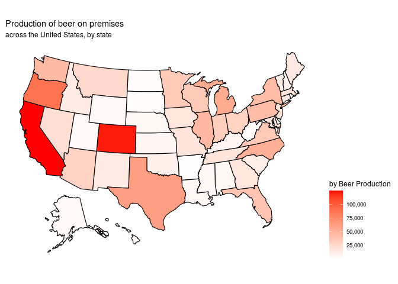
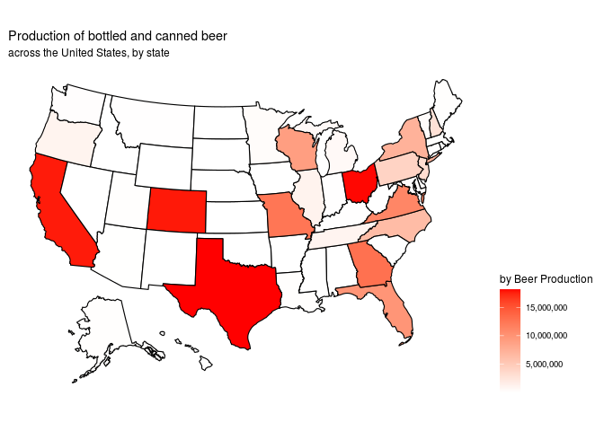

Atarandom-code
================
Greyfriars Bobby

### Libraries

``` r
library(tidyverse)
library(broom)
library(here)
library(stringr)
library(openintro)
library(usmap)
```

### Load Data

``` r
# Beer production by state
beer_states <- read_csv('https://raw.githubusercontent.com/rfordatascience/tidytuesday/master/data/2020/2020-03-31/beer_states.csv')
write_csv(beer_states, "/cloud/project/data/beer_states.csv")

# Voting data
voter_data <- read_rds("/cloud/project/data/1976-2016-president.RData")
write_rds(voter_data, "/cloud/project/data/voter_data.rds")

#Alcohol consumption per capita
consumption_per_capita <- read_csv("/cloud/project/data/apparent_per_capita_alcohol_consumption_1977_2018.txt")
write_csv(consumption_per_capita, "/cloud/project/data/apparent_per_capita_alcohol_consumption_1977_2018.txt")
```

### Code

``` r
#capitalise state first letter on consumption_per_data
consumption_per_capita <- consumption_per_capita %>%
  mutate(state = str_to_title (state))

#change state abbreviation to name on beer_states

beer_states <- beer_states %>%
  mutate(state = abbr2state (state))
```

``` r
beer_states_2015_OP <- beer_states %>% 
    filter(year == 2015, type == "On Premises") 

beer_states_2015_BC <- beer_states %>% 
    filter(year == 2015, type == "Bottles and Cans") 

beer_states_2015_KB <- beer_states %>% 
    filter(year == 2015, type == "Kegs and Barrels") 
```

``` r
plot_usmap(data = beer_states_2015_OP, values = "barrels", regions = "state", color = "black") +
  labs(title = "Production of beer on premises",
       subtitle = "across the United States, by state") + 
   scale_fill_continuous(
    low = "white", high = "red", name = "by Beer Production", label = scales::comma
  ) + theme(legend.position = "right")
```

<!-- -->

``` r
plot_usmap(data = beer_states_2015_BC, values = "barrels", regions = "state", color = "black") +
  labs(title = "Production of bottled and canned beer",
       subtitle = "across the United States, by state") + 
   scale_fill_continuous(
    low = "white", high = "red", name = "by Beer Production", label = scales::comma
  ) + theme(legend.position = "right")
```

<!-- -->

``` r
plot_usmap(data = beer_states_2015_KB, values = "barrels", regions = "state", color = "black") +     
  labs(title = "Production of beer kegs and barrels",
       subtitle = "across the United States, by state") + 
  scale_fill_continuous(
    low = "white", high = "red", name = "by Beer Production", label = scales::comma
  ) + 
  theme(legend.position = "right")
```

<!-- -->

``` r
library(tidyverse)
library(broom)
library(openintro)
library(usmap)
library(tidymodels)
library(here)
```

``` r
beer_states <- read_csv('https://raw.githubusercontent.com/rfordatascience/tidytuesday/master/data/2020/2020-03-31/beer_states.csv')
# Voting data
voter_data <- read_rds("/cloud/project/data/1976-2016-president.RData")

#Alcohol consumption per capita
consumption_per_capita <- read_csv("/cloud/project/data/apparent_per_capita_alcohol_consumption_1977_2018.txt")

electoral_votes <- read_csv("/cloud/project/data/electoral_votes.csv")
```

### Data wrangling

This chunk cleans the voting data frame into a more useful one.

``` r
# Manually merge some conflicting cells
# In some states there were two entries for the same candidate, resulting in an undesired outcome when pivoting the data

voter_data[(3536),] <- voter_data[(3536),] %>%
    mutate(candidatevotes = 1677928 + 78)
voter_data[(3537),] <- voter_data[(3537),] %>%
    mutate(candidatevotes = 943169 + 259)

# Manually rename more conflicting cells
# In Minnesota, for some years, the democrat party was entered as "democratic". Our algorithm didn't pick up the string and resulted in NA's

voter_data[(2211),] <- voter_data[(2211),] %>%
    mutate(party = "democrat")
voter_data[(2560),] <- voter_data[(2560),] %>%
    mutate(party = "democrat")
voter_data[(3226),] <- voter_data[(3226),] %>%
    mutate(party = "democrat")

# Eliminate conflicting rows

voter_data <- voter_data[-c(2545,3415,3543,3544),]
```

Once the conflicts have been fixed, we’re ready to build a data frame
with voting data that will be friendly with our model.

``` r
clean_votes <- voter_data %>%
  # Choose only the two main parties
  filter (party %in% c("democrat", "republican")) %>% 
  # Select the only variables we're interested in. Year, state, party, and how many votes the party received
  select(year, state, party, candidatevotes) %>% 
  pivot_wider(names_from = party, values_from = candidatevotes) %>%
  rename(democrat_votes = democrat, republican_votes = republican) %>%
  # Create a new variable that tells us who won the election in that state
  mutate(office = ifelse(democrat_votes > republican_votes, "democrat", "republican")) %>%
  # Filter so voting data is consistent with the rest of our data
  filter(year >= 1976)

glimpse(clean_votes)
```

    ## Rows: 561
    ## Columns: 5
    ## $ year             <int> 1976, 1976, 1976, 1976, 1976, 1976, 1976, 1976, 1976…
    ## $ state            <I<chr>> Alabama, Alaska, Arizona, Arkansas, California, C…
    ## $ democrat_votes   <dbl> 659170, 44058, 295602, 498604, 3742284, 460801, 6478…
    ## $ republican_votes <dbl> 504070, 71555, 418642, 267903, 3882244, 584278, 7192…
    ## $ office           <chr> "democrat", "republican", "republican", "democrat", …
