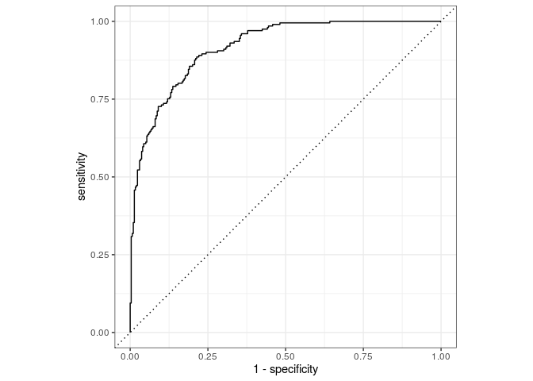
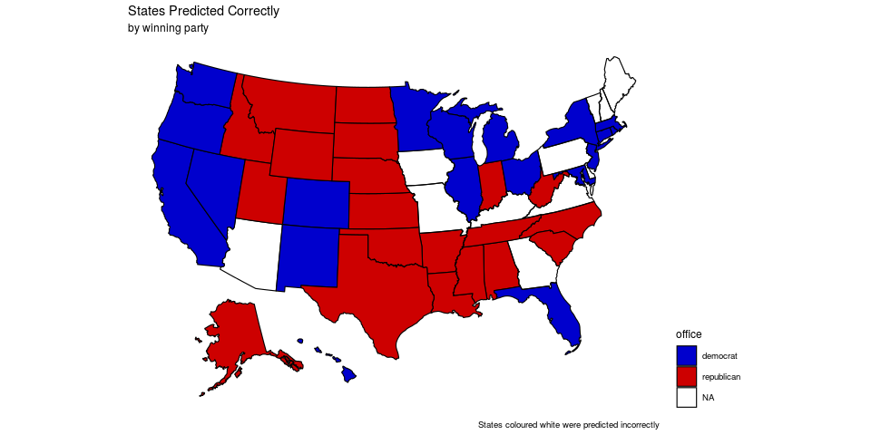
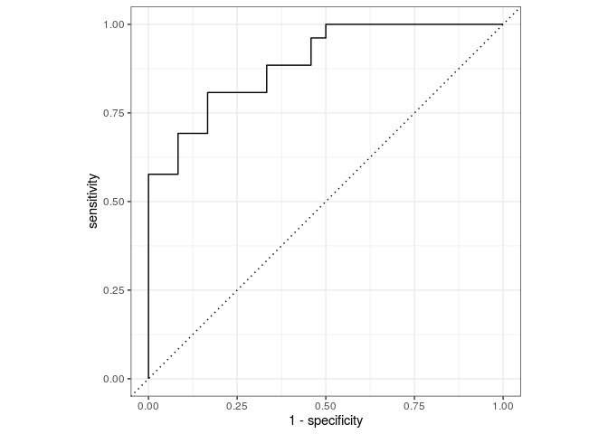

Project
================

# 1\. Data

## Define U.S. geographical regions and colors

``` r
northeast <- c("Connecticut", "Maine", "Massachusetts", "New Hampshire", "New Jersey", "New York", "Pennsylvania", "Rhode Island", "Vermont", "Delaware", "Maryland")
southeast <- c("Alabama", "Arkansas", "Florida", "Georgia", "Kentucky", "Louisiana", "Mississippi", "North Carolina", "South Carolina", "Tennessee", "Virginia", "West Virginia")
midwest <- c("Illinois", "Indiana", "Iowa", "Kansas", "Michigan", "Minnesota", "Missouri", "Nebraska", "North Dakota", "Ohio", "South Dakota", "Wisconsin")
southwest <- c("Arizona", "New Mexico", "Oklahoma", "Texas")
west <- c("Alaska", "California", "Colorado", "Hawaii", "Idaho", "Montana", "Nevada", "Oregon", "Utah", "Washington", "Wyoming")

partisan_colors <- c("democrat" = "blue3", "republican" = "red3")
```

## Merge consumption and voting data

``` r
consumption_states <- full_join(consumption_states, voting_data) %>%
  filter(!(state %in% c("District Of Columbia", "District of Columbia", "Us Total", "South Region", "Northeast Region", "Midwest Region", "West Region"))) %>%
  arrange(state, year)

# Split

split_1 <- consumption_states %>%
  filter(year == 2016)

split_2 <- consumption_states %>%
  filter(year != 2016)

for (n in 1:nrow(split_2)) {
  if ((n-1)%%4 == 0) {
  split_2$office[n] -> split_2$office[n+3]
  split_2$office[n] -> split_2$office[n+2]
  split_2$office[n] -> split_2$office[n+1]
  }
}

consumption_states <- full_join(split_1, split_2) %>%
  filter(year != 1976) %>%
  select(!democrat_votes & !republican_votes)

consumption_states["office"] <- lapply(consumption_states["office"] , factor)

consumption_states <- consumption_states %>%
  mutate(region = case_when(
    state %in% northeast ~ "northeast",
    state %in% southeast ~ "southeast",
    state %in% midwest ~ "midwest",
    state %in% southwest ~ "southwest",
    state %in% west ~ "west"
  ))
```

# 2\. Trends for alcohol consumption

<!-- -->

## 3\. Idk some other visualisation

## 4\. Modelling

### First model, fitting all data

``` r
# Drop out co linear variables
consumption_states_model <- consumption_states %>%
  select(state, beer_per_capita, wine_per_capita, spirit_per_capita, office)

# Split data into training and testing
set.seed(7637)
consumption_split <- initial_split(consumption_states_model)
consumption_train <- training(consumption_split)
consumption_test <- testing(consumption_split)
```

    ## # A tibble: 10 x 4
    ##    id    .metric  .estimator .estimate
    ##    <chr> <chr>    <chr>          <dbl>
    ##  1 Fold1 accuracy binary         0.817
    ##  2 Fold1 roc_auc  binary         0.898
    ##  3 Fold2 accuracy binary         0.817
    ##  4 Fold2 roc_auc  binary         0.885
    ##  5 Fold3 accuracy binary         0.863
    ##  6 Fold3 roc_auc  binary         0.924
    ##  7 Fold4 accuracy binary         0.867
    ##  8 Fold4 roc_auc  binary         0.942
    ##  9 Fold5 accuracy binary         0.82 
    ## 10 Fold5 roc_auc  binary         0.903

    ## # A tibble: 2 x 5
    ##   .metric  .estimator  mean     n std_err
    ##   <chr>    <chr>      <dbl> <int>   <dbl>
    ## 1 accuracy binary     0.837     5  0.0116
    ## 2 roc_auc  binary     0.910     5  0.0101

### ROC Curve and number of correct predictions

``` r
election_pred %>%
  roc_curve(
    truth = office,
    .pred_democrat) %>%
  autoplot()
```

<!-- -->

``` r
election_pred %>%
  mutate(
    prediction = ifelse(.pred_democrat > .pred_republican, "democrat", "republican")
  ) %>%
  count(prediction == office)
```

    ## # A tibble: 2 x 2
    ##   `prediction == office`     n
    ##   <lgl>                  <int>
    ## 1 FALSE                     87
    ## 2 TRUE                     413

### Predicting 2012 election

Map of states predicted correctly. The figure below indicates the number
of states predicted correctly

<!-- -->

    ## # A tibble: 1 x 2
    ##   `office == prediction`     n
    ##   <lgl>                  <int>
    ## 1 TRUE                      39

Model’s general election result

    ## Joining, by = "state"

    ## `summarise()` ungrouping output (override with `.groups` argument)

    ## # A tibble: 2 x 2
    ##   prediction total_votes
    ##   <chr>            <dbl>
    ## 1 democrat           321
    ## 2 republican         214

The actual results were: Democrat - 332 Republican - 206

### Assessing accuracy

``` r
election_2012_pred %>%
  roc_curve(
    truth = office,
    .pred_democrat) %>%
  autoplot()
```

<!-- -->

``` r
election_2012_pred %>%
  roc_auc(
    truth = office,
    .pred_democrat)
```

    ## # A tibble: 1 x 3
    ##   .metric .estimator .estimate
    ##   <chr>   <chr>          <dbl>
    ## 1 roc_auc binary         0.891

### Second model, only using spirit
