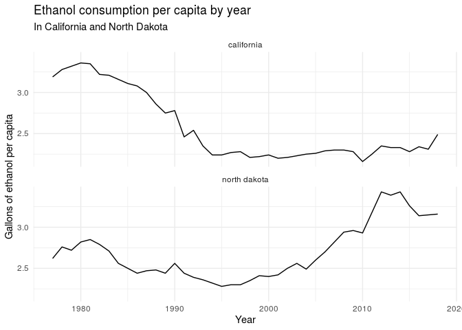
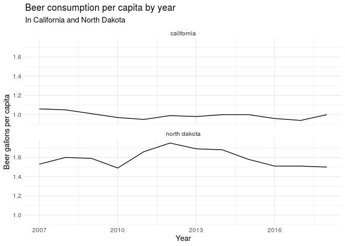
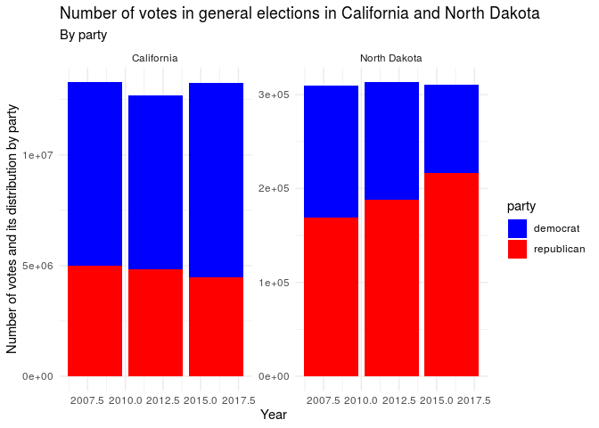

Project proposal
================
Greyfriars Bobby

``` r
library(tidyverse)
library(broom)
library(here)
```

## 1\. Introduction

Is there a relationship between a state’s beer production/consumption
and its political affiliation?

The data we are using comes from different sources:

  - Beer production data comes from the Alcohol and Tobacco Tax and
    Trade Bureau (TTB). “Beer states” contains information regarding the
    total production by year and its type sorted by US state.

  - Presidential election data comes from the MIT Election Data and
    Science lab. We were unable to find how the data was collected for
    this dataset. It includes 14 variables, to us the most relevant are
    the year of election, state, party, and number of votes.

  - Alcohol consumption per capita comes from a study conducted by the
    University of Pennsylvania. It contains estimates for ethyl alcohol
    consumption from various alcoholic drinks in gallons per capita per
    year between 1977 and 2018 for each state. These drinks include:
    beer, wine, and spirits. There is also a column which includes a
    total of all alcoholic drinks per capita.

## 2\. Data

``` r
# Beer production by state
beer_states <- read_csv('https://raw.githubusercontent.com/rfordatascience/tidytuesday/master/data/2020/2020-03-31/beer_states.csv')

# Voting data
voter_data <- read_rds("/cloud/project/data/1976-2016-president.RData")
write_rds(voter_data, "/cloud/project/data/voter_data.rds")

#Alcohol consumption per capita
consumption_per_capita <- read_csv("/cloud/project/data/apparent_per_capita_alcohol_consumption_1977_2018.txt")
```

## 3\. Data analysis plan

Our outcome variable will be the political affiliation of each state and
the explanatory variable will be its alcohol consumption per capita.

Our comparison groups will be the USA states.

We will conduct a series of visualizations in the form of plots. We will
use a map of the USA to project some of these, as they are of
geographical nature. For this, we will use the library `usmap`, which is
compatible with ggplot.

We have heard of the cliche “Republican Mid-West voters only drink
Budweiser” and we will put this to a test. It is very difficult to
hypothesize with such exploratory data. We expect Mid-West states to
have a high consumption of beer, and also high republican voter indexes.
However, it’s not clear what we will find in coastal states.

It is key noting that since we are using observational data we will not
be able to show causation even if we find a strong association between
variables.

# Skimming candidate data

We will explore the candidate data we have and narrow it down to the
time frame we want, 2008 to 2016, and the variables which are useful to
us (for now).

``` r
votes_by_candidate <- voter_data %>%
  filter(year >= 2008, party == "republican" | party == "democrat") %>% #We only want the two major parties from 2008 to 2018
  rename( 
    candidate_votes = 'candidatevotes' #rename to snakecase
  ) %>%
  select(year, state, candidate, party, candidate_votes) #We are only interested in these 5 variables

head(votes_by_candidate)
```

    ##      year   state        candidate      party candidate_votes
    ## 2729 2008 Alabama     McCain, John republican         1266546
    ## 2730 2008 Alabama Obama, Barack H.   democrat          813479
    ## 2733 2008  Alaska     McCain, John republican          193841
    ## 2734 2008  Alaska Obama, Barack H.   democrat          123594
    ## 2739 2008 Arizona     McCain, John republican         1230111
    ## 2740 2008 Arizona Obama, Barack H.   democrat         1034707

# Preliminary Data Analysis

We will briefly compare on how the consumption per capita of alcoholic
beverages (beer, wine, spirit) has evolved during the years between two
states with very different geographical features: California and North
Dakota.

``` r
consumption_per_capita %>%
  filter(state == 'california' | state == 'north dakota') %>%
  ggplot(aes(x = year, y = ethanol_all_drinks_gallons_per_capita)) +
  geom_line() +
  facet_wrap(~state, nrow = 2) +
  labs(
    title = "Ethanol consumption per capita by year",
    subtitle = "In California and North Dakota",
    x = "Year",
    y = "Gallons of ethanol per capita"
  ) +
  theme_minimal()
```

<!-- -->

This is quite an interesting comparison since the two graphs are
completely different. In California alcohol consumption per capita has
overall decreased, while in North Dakota it has increased. Let’s look at
only the consumption of beer between 2007 and 2019:

``` r
consumption_per_capita %>%
  filter(year >= 2007, state == 'california' | state == 'north dakota') %>%
  ggplot(aes(x = year, y = ethanol_beer_gallons_per_capita)) +
  geom_line() +
  facet_wrap(~state, nrow = 2) +
  labs(
    title = "Beer consumption per capita by year",
    subtitle = "In California and North Dakota",
    x = "Year",
    y = "Beer gallons per capita"
  ) +
  theme_minimal()
```

<!-- -->

There’s a clear difference of beer consumption per capita between the
two states.

Let’s look now on how those states voted in the 2008, 2010, and 2016
general elections.

``` r
partisan_colors <- c("democrat" = "blue", "republican" = "red") 
#We'll assign specific colors to each party to make our visualization easier

votes_by_candidate %>%
  filter (state == "North Dakota" | state == "California") %>%
  ggplot(aes(x = year, y = candidate_votes, fill = party)) +
  geom_col() +
  facet_wrap(~state, scales = "free_y") +
  theme_minimal() +
  labs(
    title = "Number of votes in general elections in California and North Dakota",
    subtitle = "By party",
    x = "Year",
    y = "Number of votes and its distribution by party"
  ) +
  
  scale_fill_manual(values = partisan_colors)
```

<!-- -->

California has had a Democrat majority in the past 3 elections, while
North Dakota has had a Republican one.

So, North Dakota drinks more beer than California, and it votes more
Republican than California, which is in line with our hypothesized
results.
